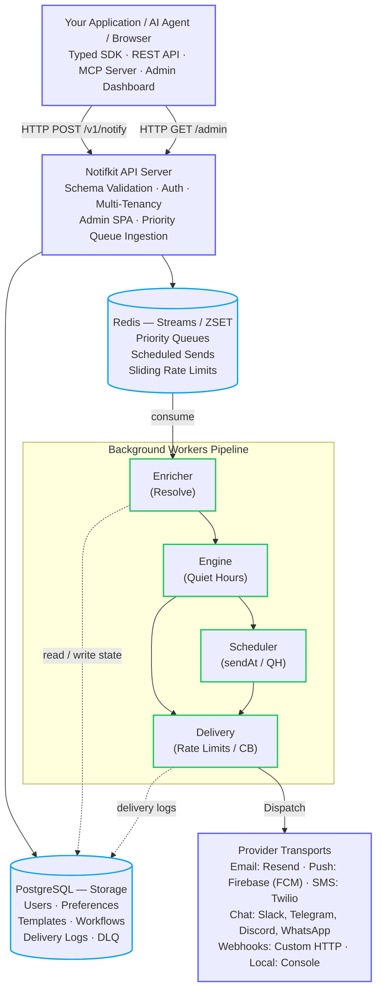

<div align="center">

# notifkit

**You shouldn't have to build a notification system.**

Self-hosted notification infrastructure for product notifications. One API call handles email, SMS, push, and webhooks, with preferences, quiet hours, retries, fallback, scheduling, workflows, an admin dashboard, and delivery logs built in.

[](https://www.npmjs.com/package/notifkit) [](https://www.npmjs.com/package/notifkit) [](https://github.com/devkitshq/notifkit/actions/workflows/ci.yml) [](https://www.typescriptlang.org/) [](https://nodejs.org) [](./LICENSE)

[Documentation](https://notifkit.dev/docs/) · [Quickstart](https://notifkit.dev/docs/quickstart.html) · [Examples](https://notifkit.dev/docs/examples.html) · [notifkit.dev](https://notifkit.dev)

</div>

### Sending one notification is easy

```ts
await sendEmail({
  to: user.email,
  subject: "Order Shipped",
  ...
});
```

Sending them reliably is the hard part. Users opt out. People are asleep. Push tokens die. Providers throw 503s. Channels fail and need fallback. Somewhere along the way you need timezone-aware quiet hours, future scheduling, deduplication, multi-channel templates, delivery logs, unsubscribe handling, multi-step workflows, and a dead-letter queue nobody wants to maintain.

notifkit is that machinery. Your app makes one typed call, and notifkit decides who gets the notification, which channel to use, when to send it, whether the user is allowed to receive it, and what to do when delivery fails.

```ts
import { notifkit } from "notifkit";

await notifkit.notify({
  user: "usr_123",
  template: "order-shipped",
  channels: ["push", "email"],
  fallback: true,
});
```

That call tries push, then email if push fails. Preferences, consent, quiet hours, retries, deduplication, throttling, template rendering, and delivery tracking all happen behind it.

## How it runs

notifkit is an orchestration engine and a typed SDK.



`NotifkitServer` runs the HTTP REST API router (`/v1/notify`, `/health`, `/metrics`), the built-in admin dashboard (`/admin`), and the background worker pipelines: enricher, decision engine, scheduler, and delivery. `NotifkitClient` is the lightweight client your application uses to trigger notifications, sync templates, and manage users over HTTP.

### Topologies

In a single process, the API and all workers run in the same Node.js process (`services: ["all"]`), which works for small and medium apps, side projects, and staging. Distributed, you run stateless API servers (`services: ["api"]`) behind a load balancer and scale worker pools (`services: ["enricher", "engine", "delivery", "scheduler"]`) horizontally across Redis Streams consumer groups.

## Quickstart (needs 5 mins)

### 1. Install

```bash
npm install notifkit @notifkit/provider-resend
npm install -D tsx @testcontainers/postgresql @testcontainers/redis
```

The `@testcontainers/*` packages start throwaway PostgreSQL and Redis containers for local development when `DATABASE_URL` and `REDIS_URL` are not set.

> [!WARNING]
> In production, point notifkit at real PostgreSQL and Redis instances via `DATABASE_URL` and `REDIS_URL`, and run with `NODE_ENV=production`.

### 2. Run the engine

`server.ts` starts the API and the worker pipelines. In development it auto-starts those containers, so Docker is the only prerequisite.

```ts
import { NotifkitServer } from "notifkit";
import { ResendTransport } from "@notifkit/provider-resend";

const server = new NotifkitServer({
  services: ["all"],
  port: 3000,
  databaseUrl: process.env.DATABASE_URL,
  redisUrl: process.env.REDIS_URL,
  adminUser: {
    email: "admin@example.com",
    password: "supersecretpassword123",
  },
  providers: [
    new ResendTransport({
      apiKey: process.env.RESEND_API_KEY!,
      from: "notifications@yourdomain.com",
    }),
  ],
});

await server.start();
console.log("notifkit listening on http://localhost:3000");
```

`from` is required on `ResendTransport` — it is the sender for any template that does not name its own, and it has to be an address on a domain you have verified in Resend. A template can override it with its own `from`, so one transport can serve both `no-reply@` receipts and `marketing@` campaigns.

`adminUser` (or `ADMIN_EMAIL` and `ADMIN_PASSWORD` in the environment) seeds your initial dashboard login credentials in PostgreSQL on startup.

`ADMIN_API_KEY` is the root credential that mints project API keys. In production, use a long random string (`openssl rand -hex 32`). Locally, any string works:

```bash
ADMIN_API_KEY=supersecretkey RESEND_API_KEY=re_xxx npx tsx server.ts
```

### 3. Create a project and its API key

Every `/v1/*` route requires a project API key, and only the admin credential can mint one. You can create projects via the CLI helper or in the admin dashboard under **Projects & API Keys** (`/admin/projects`):

```bash
ADMIN_API_KEY=supersecretkey npx notifkit-create-project "my-app"
```

```
Project "my-app" created. Save the API key now — it is not recoverable.

NOTIFKIT_PROJECT_ID=1ce67fa1-b4a9-4985-8046-ef6018912b2a
NOTIFKIT_API_KEY=nk_live_f57c57b76d795cef89e2dbf6b6f352a36…
```

The server stores only a SHA-256 hash of the key, so the `nk_live_…` value is printed once and never again — put it in your app's `.env` now. Point the script at another host with `NOTIFKIT_URL`, and mint further keys later with `POST /v1/projects/:id/keys` (`role: "read_only"` there gets you a key that can read but not send) or directly in the web dashboard.

### 4. Dispatch your first notification

`client.ts` is your application code. It talks to the server over HTTP: register a template, register a user, and send.

```ts
// client.ts
import { NotifkitClient } from "notifkit";

const notifkit = new NotifkitClient({
  baseUrl: "http://localhost:3000",
  apiKey: process.env.NOTIFKIT_API_KEY!,
});

// 1. Register a template
await notifkit.syncTemplates({
  templates: [
    {
      id: "order-shipped",
      channel: "email",
      content: { subject: "Order #{{orderId}} Shipped", text: "Your order is on the way!" },
    },
  ],
});

// 2. Register a user (supports id + contacts array or object)
await notifkit.addUser("usr_123", [{ channel: "email", target: "alex@acme.com" }]);

// 3. Dispatch
await notifkit.notify({
  user: "usr_123",
  template: "order-shipped",
  channels: ["email"],
  data: { orderId: "9481" },
});
```

With the server still running in the first terminal, run the client in a second one:

```bash
NOTIFKIT_API_KEY=nk_live_xxx npx tsx client.ts
```

### 5. Or call the REST API directly

The Node.js SDK is optional. notifkit exposes a standard HTTP REST API, so you can dispatch notifications and manage resources from any language (cURL, Python, Go, and so on). The same project API key goes in the `Authorization` header (an `x-api-key` header works too):

```bash
curl -X POST http://localhost:3000/v1/notify \
  -H "Content-Type: application/json" \
  -H "Authorization: Bearer $NOTIFKIT_API_KEY" \
  -d '{
    "user": "usr_123",
    "template": "order-shipped",
    "channels": ["email"],
    "data": { "orderId": "9481" }
  }'
```

### Development vs. production

Locally, Docker is the only prerequisite: in development notifkit starts throwaway PostgreSQL and Redis containers for you. In production you need Node 22+, PostgreSQL, and Redis, and you run migrations by pointing `drizzle-kit` at `node_modules/notifkit/drizzle`.

## Running in production

notifkit runs in production at my own company, delivering 100K+ notifications a day across email, push, and OTPs. I built it because I needed it and didn't want to spend months rebuilding distributed notification plumbing or pay a SaaS per alert. It runs on your servers, with your provider accounts and your data.

### Reliability and resilience

Every component is tested against failure using real testcontainers:

- **Crash recovery**: Worker processes killed with `SIGKILL` mid-stream lose zero messages. Redis Streams consumer groups (PEL) auto-reclaim and replay in-flight work.
- **Connection resilience**: Disconnections from PostgreSQL or Redis trigger automatic backpressure and reconnects without dropping state.
- **High throughput & concurrency**: 10,000+ notification bursts with sliding-window rate limiters, flat memory profiles, and 24-hour idempotency deduplication.

## Scope

notifkit is the durable notification layer that runs inside your own stack. It is not a marketing automation suite, and it does not replace Customer.io, OneSignal, or SendGrid. You bring your own provider accounts and pay them directly.

First-party providers cover Resend, Firebase Cloud Messaging, Slack, Twilio, Telegram, Discord, and WhatsApp. Anything else is a `Transport` class with a `send()` method.

## Agent-operable

https://github.com/user-attachments/assets/4dff98bb-37d3-44b4-bf46-9607c1cd89b5

An AI agent can operate notifkit directly. Connect the notifkit MCP server ([`@notifkit/mcp`](./packages/mcp)) to Claude Code, Cursor, Claude Desktop, Gemini, or any MCP-compatible agent:

```bash
npx -y @notifkit/mcp
```

### Ask your agent

```text
You: Why didn't usr_9182 receive their password reset?

Agent: The notification was suppressed because usr_9182's email
       address has a hard-bounce suppression from yesterday.
```

Your application and your AI agents use the same notification infrastructure. Through MCP an agent can:

- Send one-off notifications or campaigns to users, lists, and segments (`send_notification`, `send_campaign`)
- Diagnose delivery issues by inspecting message histories, provider responses, and quiet hours (`get_delivery_logs`, `get_notification`)
- Schedule future sends and cancel pending notifications (`list_scheduled`, `cancel_notification`)
- Check delivery, open, click, bounce, and complaint metrics (`list_campaigns`, `get_campaign_stats`)
- List, preview, and update templates with sample data (`list_templates`, `preview_template`, `upsert_template`)
- Look up users, contacts, preferences, and segment membership (`list_users`, `get_user_preferences`, `update_user_preferences`)
- Trigger workflows and inspect workflow runs (`create_workflow`, `trigger_workflow`, `get_workflow_run`)
- Manage bounce suppressions, check system queues, and replay dead-letter messages (`list_suppressions`, `get_dead_letters`, `replay_dead_letter`)

### The same task, with and without an agent

| Without an agent                                                                                                                                                               | With the notifkit MCP server                                                                                                                                                                                                                                                                                                                                                      |
| :----------------------------------------------------------------------------------------------------------------------------------------------------------------------------- | :-------------------------------------------------------------------------------------------------------------------------------------------------------------------------------------------------------------------------------------------------------------------------------------------------------------------------------------------------------------------------------- |
| Query the database for contact info, open Twilio or Resend or write a throwaway script, format the payload, check the user's timezone by hand, send it, and hope it delivered. | **You:** _"Send an urgent update to alex@acme.com that his package was lost in transit and support is rushing a replacement. Text him if push doesn't deliver."_<br><br>**Agent:** Looks up `alex@acme.com`, renders the template, dispatches push with SMS fallback, bypasses quiet hours because the send is urgent, tracks delivery status, and confirms it reached his phone. |

[MCP documentation](https://notifkit.dev/docs/mcp.html)

## AI-assisted migration

Already have notification code scattered across your application? Point your coding agent at:

```text
https://notifkit.dev/llms-full.txt
```

It can read notifkit's API from there, find ad-hoc notification code in your repository, and refactor it into notifkit calls.

## Feature matrix

| Feature             | Capabilities                                                                             |
| :------------------ | :--------------------------------------------------------------------------------------- |
| **Channels**        | `email`, `sms`, `push`, `webhook`, `telegram`, `discord`, `whatsapp`, `slack`, `console` |
| **Admin Dashboard** | Built-in SPA at `/admin` for live feeds, DLQ triage, queue metrics, workflows, templates |
| **Targeting**       | A user, a list of users, a segment, or a topic                                           |
| **Priorities**      | `low`, `normal`, `high`, `critical`, on separate stream lanes                            |
| **Scheduling**      | Future sends with `sendAt`, quiet-hours deferral, cancellation                           |
| **Preferences**     | Per-user channel and topic opt-outs, quiet hours, contact-level overrides                |
| **Workflows**       | Multi-step sequences with `wait`, `waitForEvent`, and `notify` steps                     |
| **Reliability**     | Redis Streams, 24h idempotency, retries, DLQ, provider circuit breakers                  |
| **Templates**       | `{{var}}` interpolation with destination-aware escaping                                  |
| **AI**              | Optional LLM augmentation before render via the Vercel AI SDK                            |
| **Multi-tenancy**   | Projects with isolated keys, data, and rate limits                                       |
| **Consent**         | RFC 8058 one-click unsubscribe; complaints and hard bounces suppress automatically       |
| **Reporting**       | Campaign labels with delivery and engagement totals                                      |
| **Agent operation** | MCP server for sending, triage, campaigns, templates, workflows, and system operations   |
| **Observability**   | Prometheus `/metrics`, `/health`, `/live`, `/ready`, and queryable delivery logs         |

## Providers

Bring your own provider accounts. First-party packages:

- [`@notifkit/provider-resend`](./packages/provider-resend): transactional email via Resend
- [`@notifkit/provider-fcm`](./packages/provider-fcm): push notifications via Firebase Cloud Messaging
- [`@notifkit/provider-slack`](./packages/provider-slack): Slack messages via Incoming Webhooks or the Web API
- [`@notifkit/provider-twilio`](./packages/provider-twilio): SMS via Twilio, with signature-verified delivery status callbacks
- [`@notifkit/provider-telegram`](./packages/provider-telegram): messages via a Telegram bot
- [`@notifkit/provider-discord`](./packages/provider-discord): messages via a Discord webhook
- [`@notifkit/provider-whatsapp`](./packages/provider-whatsapp): messages via Meta's WhatsApp Cloud API
- [`@notifkit/provider-console`](./packages/provider-console): console transport for local development and testing

For anything else, implement a `Transport`:

```ts
class MyTransport implements Transport {
  async send(message) {
    // Send through SES, Postmark, APNs,
    // SendGrid, a custom webhook, or anything else.
  }
}
```

The keys, the billing, and the deliverability stay yours.

## Admin dashboard

notifkit includes a web console served directly at `/admin` for operational management:

- **Live activity feed & logs**: Real-time SSE stream for worker transitions, delivery histories, and error diagnostics.
- **Queue analytics & DLQ triage**: Redis Streams lane gauges (`low`, `normal`, `high`, `critical`), message replay, and dead-letter queue management.
- **Workflows & template studio**: Visual multi-step sequence viewer (`wait`, `waitForEvent`, `notify`) with execution step tracing and live template previews.
- **Users, projects & API keys**: Manage recipient preferences, quiet hours, projects, and scoped API keys (`admin` or `read_only`).

### Accessing and running the dashboard

Once the server is running, visit `http://localhost:3000/admin` and sign in with the admin credentials you configured.

You can also create or update admin users at any time via the CLI:

```bash
npx notifkit-create-admin admin@example.com supersecretpassword123
```

In production, the pre-built dashboard bundle in `dashboard/dist` is served automatically. In development, run `npm --prefix dashboard run dev` to start the Vite development server with hot module replacement (the API server automatically proxies `/admin` requests to port 5173).

## Documentation

Everything lives at [**notifkit.dev/docs**](https://notifkit.dev/docs/).

| Guide                                                                          | Description                                              |
| :----------------------------------------------------------------------------- | :------------------------------------------------------- |
| [Quickstart](https://notifkit.dev/docs/quickstart.html)                        | Install to first delivered notification                  |
| [How it works](https://notifkit.dev/docs/concepts.html)                        | Core concepts and the notification pipeline              |
| [Channels & fallback](https://notifkit.dev/docs/guides/routing.html)           | Multicast, ordered fallback, and custom transports       |
| [Preferences & quiet hours](https://notifkit.dev/docs/guides/preferences.html) | Preference, consent, and timing rules                    |
| [Templates & AI](https://notifkit.dev/docs/guides/templates.html)              | Interpolation, escaping, and per-channel content         |
| [Segments & scheduling](https://notifkit.dev/docs/guides/segments.html)        | Fan-out, priority lanes, `sendAt`, and idempotency       |
| [Workflows](https://notifkit.dev/docs/guides/workflows.html)                   | Multi-step sequences, recurring sends, and digests       |
| [Examples](https://notifkit.dev/docs/examples.html)                            | Runnable projects                                        |
| [Architecture](https://notifkit.dev/docs/architecture.html)                    | Streams, delivery guarantees, topologies, and data model |
| [Deployment](https://notifkit.dev/docs/deployment.html)                        | Docker, Compose, and production topologies               |
| [Operations](https://notifkit.dev/docs/operations.html)                        | Health, metrics, DLQ, key rotation, and shutdown         |
| [Reference](https://notifkit.dev/docs/reference.html)                          | API, payloads, and SDK methods                           |
| [MCP server](https://notifkit.dev/docs/mcp.html)                               | Operate notifkit from an AI agent                        |

## Why build this?

Notification infrastructure looks simple until you're responsible for it. Queues, retries, provider adapters, preference systems, quiet-hour logic, workflows, suppression handling, and operational tooling take months to build well. notifkit is what I built instead, and it's what I run.

## Contributing

Issues and pull requests are welcome. Stars help other people find the project.

```bash
npm install
npm run build
npm run build:dashboard
npm test
```

The test suite starts its own PostgreSQL and Redis containers, so Docker is the only thing you need running.

## Contact

Questions, bugs, or ideas: [contact.devkitshq@gmail.com](mailto:contact.devkitshq@gmail.com), or open an issue.

## License

MIT. Do what you like with it, including commercially. See [LICENSE](./LICENSE).
