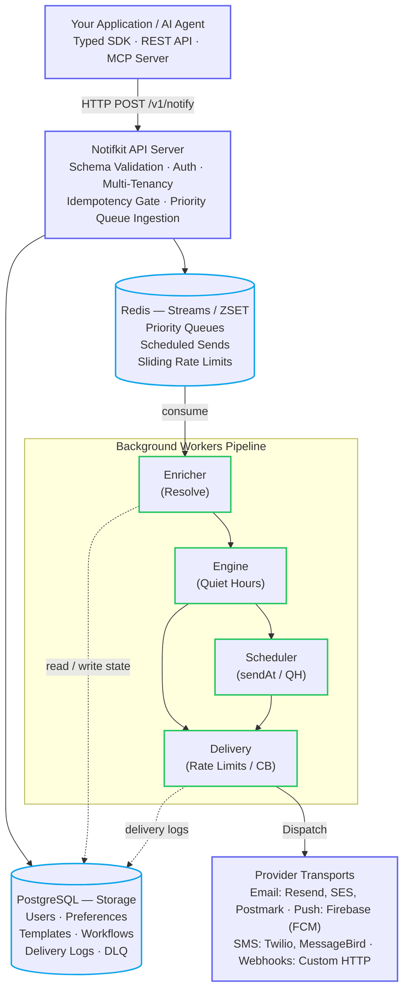
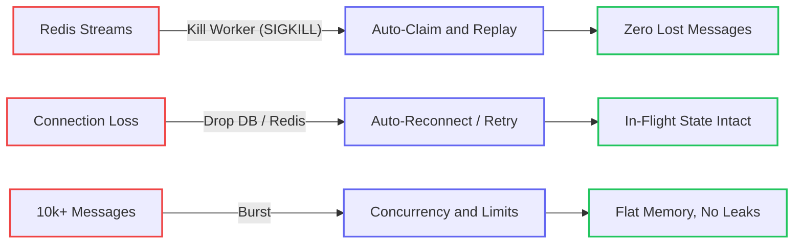

<div align="center">

# notifkit

**You shouldn't have to build a notification system.**

Self-hosted notification infrastructure for product notifications. One API call handles email, SMS, push, and webhooks — with preferences, quiet hours, retries, fallback, scheduling, workflows, and delivery logs built in.

[](https://www.npmjs.com/package/notifkit) [](https://www.npmjs.com/package/notifkit) [](https://github.com/devkitshq/notifkit) [](https://www.typescriptlang.org/) [](https://nodejs.org) [](./LICENSE)

[Documentation](https://notifkit.dev/docs/) · [Quickstart](https://notifkit.dev/docs/quickstart.html) · [Examples](https://notifkit.dev/docs/examples.html) · [notifkit.dev](https://notifkit.dev)

</div>

---

<video src="assets/ai_demo.mp4" controls="controls" muted="muted" width="100%"></video>

---

### The first notification is easy

```ts
await sendEmail({
  to: user.email,
  subject: "Order Shipped",
  ...
});
```

### Then reality hits

Users opt out. People are asleep. Push tokens die. Providers throw 503s. Some channels fail and need fallback. You need timezone-aware quiet hours, future scheduling, deduplication, multi-channel templates, delivery logs, unsubscribe handling, multi-step workflows, and a dead-letter queue nobody wants to maintain.

**notifkit is that machinery, already built.**

Your app makes one typed call. notifkit handles the rest — **who gets it, which channel to use, when to send it, whether they're allowed to receive it, and what happens when delivery fails.**

```ts
import { notifkit } from "notifkit";

await notifkit.notify({
  user: "usr_123",
  template: "order-shipped",
  channels: ["push", "email"],
  fallback: true,
});
```

> **Push first. If it fails, email.**
>
> Preferences, consent, quiet hours, retries, deduplication, throttling, template rendering, and delivery tracking happen behind that single call.

---

## What actually runs

notifkit is both an **orchestration engine** and a **typed SDK**.



- **`NotifkitServer`**: Runs the HTTP REST API router (`/v1/notify`, `/health`, `/metrics`) and the background worker pipelines (enricher, decision engine, scheduler, delivery).
- **`NotifkitClient`**: The lightweight client your application uses to trigger notifications, sync templates, and manage users over HTTP.

### Topologies

- **Single Process (Monolith)**: Run the API and all workers in the same Node.js process (`services: ["all"]`). Perfect for small-to-medium apps, side projects, and staging.
- **Distributed Services**: Run stateless API servers (`services: ["api"]`) behind a load balancer and scale worker pools (`services: ["enricher", "engine", "delivery", "scheduler"]`) horizontally across Redis Streams consumer groups.

---

## Battle-tested for production

> **Battle-tested in production:** notifkit powers production notification pipelines handling **thousands of emails, push notifications, and OTPs every day.**
>
> It is the infrastructure we built because we needed it ourselves — rather than spending months reinventing distributed notification plumbing or paying SaaS tolls per alert.

**Your servers. Your providers. Your data. Zero notification SaaS markups.**

### Reliability & Chaos Engineering

Because notification delivery is mission-critical, every pipeline component is tested against extreme failure conditions:



- **Chaos Monkey Testing (`tests/chaos/crash.test.ts`)**: Background worker processes are randomly terminated with `SIGKILL` during active, high-throughput message streaming. Consumer group Pending Entries List (PEL) re-claims guarantee **zero lost messages** and seamless failover.
- **Infrastructure Recovery Testing (`tests/chaos/recovery.test.ts`)**: PostgreSQL and Redis connections are forcefully severed and restored under live traffic. Verifies automatic client reconnection, worker backpressure, and durable state resumption.
- **High-Throughput Load Testing (`tests/chaos/load.test.ts`)**: Stressed with bursts of **10,000+ notifications** across parallel worker pools, verifying queue drain velocity, sliding-window rate limiters, and flat memory profiles without leaks.
- **Race Conditions & Concurrency (`tests/race-conditions.test.ts`, `tests/idempotency.test.ts`)**: Hardened against concurrent duplicate dispatches, overlapping quiet-hour boundary evaluations, atomic user updates, and 24-hour idempotency key deduplication.
- **100% Real Ephemeral Containers**: Unit, integration, and chaos test suites execute against real PostgreSQL and Redis containers via [Testcontainers](https://testcontainers.com), eliminating mocks for core storage and streaming primitives.

---

## What you get

| The problem you don't want to build                      | How notifkit solves it                                               |
| :------------------------------------------------------- | :------------------------------------------------------------------- |
| **“Should this user receive it?”**                       | User preferences, topic opt-outs, and consent gates                  |
| **“Is this a bad time to send?”**                        | Timezone-aware quiet hours that defer non-urgent sends               |
| **“What if push fails?”**                                | Automatic ordered multi-channel fallback (`push` → `email` → `sms`)  |
| **“What if my worker crashes?”**                         | Redis Streams consumer groups, retries, and durable idempotency      |
| **“What if an event fires twice?”**                      | 24-hour deduplication via idempotency keys                           |
| **“Can I send this later?”**                             | Priority scheduling with `sendAt` and cancellation before dispatch   |
| **“Can I send this 3 days after signup?”**               | Stateful multi-step workflows with `wait` and `waitForEvent`         |
| **“How do I know what happened?”**                       | Queryable delivery logs, Prometheus metrics, and campaign reporting  |
| **“What happens when a provider goes down?”**            | Circuit breakers, exponential backoff, and DLQ replay                |
| **“What about bounces and spam complaints?”**            | RFC 8058 one-click unsubscribe and automatic hard-bounce suppression |
| **“What if I don't want another SaaS holding my data?”** | 100% self-hosted on your PostgreSQL and Redis                        |

> **The idea is simple:** You decide what to say. **notifkit handles getting it there reliably.**

---

## What notifkit is — and what it isn't

**What it is:** the durable notification infrastructure layer running directly inside your own stack.

**What it isn't:** a marketing automation suite.

notifkit is not Customer.io, OneSignal, or SendGrid. You bring your own provider accounts — your keys, your billing, your deliverability.

First-party providers ship for Resend and Firebase Cloud Messaging. Anything else is a simple `Transport` class with a `send()` method.

---

## Quickstart

### 1. Install

```bash
npm install notifkit @notifkit/provider-resend
```

### 2. Run the engine and dispatch your first notification

```ts
import { NotifkitServer, NotifkitClient } from "notifkit";
import { ResendTransport } from "@notifkit/provider-resend";

// 1. Start the server (runs API + workers; auto-starts Postgres & Redis in dev)
const server = new NotifkitServer({
  services: ["all"],
  port: 3000,
  providers: [new ResendTransport({ apiKey: process.env.RESEND_API_KEY! })],
});
await server.start();

// 2. Instantiate client and register a template
const notifkit = new NotifkitClient({ baseUrl: "http://localhost:3000" });

await notifkit.syncTemplates({
  templates: [
    {
      id: "order-shipped",
      channel: "email",
      content: { subject: "Order #{{orderId}} Shipped", text: "Your order is on the way!" },
    },
  ],
});

// 3. Register user and dispatch
await notifkit.addUser({ id: "usr_123", email: "alex@acme.com" });

await notifkit.notify({
  user: "usr_123",
  template: "order-shipped",
  channels: ["email"],
  data: { orderId: "9481" },
});
```

### 3. Or call directly via REST API

You don't need the Node.js SDK — notifkit exposes a standard HTTP REST API, so you can dispatch notifications and manage resources from any language (cURL, Python, Go, etc.):

```bash
curl -X POST http://localhost:3000/v1/notify \
  -H "Content-Type: application/json" \
  -d '{
    "user": "usr_123",
    "template": "order-shipped",
    "channels": ["email"],
    "data": { "orderId": "9481" }
  }'
```

### Development vs. Production

- **Local Development**: Docker is the only prerequisite. In development, notifkit starts throwaway PostgreSQL and Redis containers automatically.
- **Production**: Node 22+, PostgreSQL, Redis. Run migrations by pointing `drizzle-kit` at `node_modules/notifkit/drizzle`.

---

## Agent-operable

**notifkit isn't just an API your application can call — your AI agent can operate it directly.**

Connect the notifkit MCP server ([`@notifkit/mcp`](./packages/mcp)) to Claude Code, Cursor, Claude Desktop, Gemini, or any MCP-compatible agent:

```bash
npx -y @notifkit/mcp
```

### Ask your agent

```text
You: Why didn't usr_9182 receive their password reset?

Agent: The notification was suppressed because usr_9182's email
       address has a hard-bounce suppression from yesterday.
```

Your application and your AI agents use the **same notification infrastructure**:

- **Send & dispatch** — Send one-off notifications or campaigns to users, lists, and segments (`send_notification`, `send_campaign`)
- **Investigate & triage** — Diagnose delivery issues by inspecting message histories, provider responses, and quiet hours (`get_delivery_logs`, `get_notification`)
- **Schedule & cancel** — Schedule future sends and cancel pending notifications (`list_scheduled`, `cancel_notification`)
- **Campaign analytics** — Check delivery, open, click, bounce, and complaint metrics (`list_campaigns`, `get_campaign_stats`)
- **Template management** — List, preview, and update templates with sample data (`list_templates`, `preview_template`, `upsert_template`)
- **Users & preferences** — Look up users, contacts, preferences, and segment membership (`list_users`, `get_user_preferences`, `update_user_preferences`)
- **Workflow operations** — Trigger workflows and inspect workflow runs (`create_workflow`, `trigger_workflow`, `get_workflow_run`)
- **Suppressions & health** — Manage bounce suppressions, check system queues, and replay dead-letter messages (`list_suppressions`, `get_dead_letters`, `replay_dead_letter`)

### From “write a script” to “just ask”

| Without an agent                                                                                                                                                              | With NotifKit MCP                                                                                                                                                                                                                                                                                                                                                   |
| :---------------------------------------------------------------------------------------------------------------------------------------------------------------------------- | :------------------------------------------------------------------------------------------------------------------------------------------------------------------------------------------------------------------------------------------------------------------------------------------------------------------------------------------------------------------ |
| Jump into the DB to find contact info → open Twilio/Resend or write a throwaway script → format the payload → check their timezone manually → fire it off → hope it delivered | **You:** _“Send an urgent update to alex@acme.com that his package was lost in transit and support is rushing a replacement — text him if push doesn't deliver.”_<br><br>**Agent:** Looks up `alex@acme.com` → renders template → dispatches push with SMS fallback → bypasses quiet hours for urgent delivery → tracks delivery status → confirms it hit his phone |

[Set up MCP](https://notifkit.dev/docs/mcp.html) · [MCP documentation](https://notifkit.dev/docs/mcp.html)

---

## AI-assisted migration

Already have notification code scattered across your application?

Point your coding agent at:

```text
https://notifkit.dev/llms-full.txt
```

It can understand notifkit's API and help identify ad-hoc notification code in your repository and refactor it into durable notifkit calls.

---

## Feature matrix

|                     |                                                                                        |
| :------------------ | :------------------------------------------------------------------------------------- |
| **Channels**        | `email`, `sms`, `push`, `webhook`                                                      |
| **Targeting**       | A user, a list of users, a segment, or a topic                                         |
| **Priorities**      | `low`, `normal`, `high`, `critical` — separate stream lanes                            |
| **Scheduling**      | Future sends with `sendAt`, quiet-hours deferral, cancellation                         |
| **Preferences**     | Per-user channel and topic opt-outs, quiet hours, contact-level overrides              |
| **Workflows**       | Multi-step sequences with `wait`, `waitForEvent`, and `notify` steps                   |
| **Reliability**     | Redis Streams, 24h idempotency, retries, DLQ, provider circuit breakers                |
| **Templates**       | `{{var}}` interpolation with destination-aware escaping                                |
| **AI**              | Optional LLM augmentation before render via the Vercel AI SDK                          |
| **Multi-tenancy**   | Projects with isolated keys, data, and rate limits                                     |
| **Consent**         | RFC 8058 one-click unsubscribe; complaints and hard bounces suppress automatically     |
| **Reporting**       | Campaign labels with delivery and engagement totals                                    |
| **Agent operation** | MCP server for sending, triage, campaigns, templates, workflows, and system operations |
| **Observability**   | Prometheus `/metrics`, `/health`, `/live`, `/ready`, and queryable delivery logs       |

---

## Providers

Bring your own provider accounts.

First-party packages:

- [`@notifkit/provider-resend`](./packages/provider-resend) — transactional email via Resend
- [`@notifkit/provider-fcm`](./packages/provider-fcm) — push notifications via Firebase Cloud Messaging

For anything else, implement a simple `Transport`:

```ts
class MyTransport implements Transport {
  async send(message) {
    // Send through Twilio, SES, Postmark, APNs,
    // SendGrid, a custom webhook, or anything else.
  }
}
```

**Your keys. Your billing. Your deliverability.**

---

## Documentation

Everything lives at [**notifkit.dev/docs**](https://notifkit.dev/docs/).

|                                                                                |                                                          |
| :----------------------------------------------------------------------------- | :------------------------------------------------------- |
| [Quickstart](https://notifkit.dev/docs/quickstart.html)                        | Install to first delivered notification                  |
| [How it works](https://notifkit.dev/docs/concepts.html)                        | Core concepts and the notification pipeline              |
| [Channels & fallback](https://notifkit.dev/docs/guides/routing.html)           | Multicast, ordered fallback, and custom transports       |
| [Preferences & quiet hours](https://notifkit.dev/docs/guides/preferences.html) | Preference, consent, and timing rules                    |
| [Templates & AI](https://notifkit.dev/docs/guides/templates.html)              | Interpolation, escaping, and per-channel content         |
| [Segments & scheduling](https://notifkit.dev/docs/guides/segments.html)        | Fan-out, priority lanes, `sendAt`, and idempotency       |
| [Workflows](https://notifkit.dev/docs/guides/workflows.html)                   | Multi-step sequences, recurring sends, and digests       |
| [Examples](https://notifkit.dev/docs/examples.html)                            | Runnable projects                                        |
| [Architecture](https://notifkit.dev/docs/architecture.html)                    | Streams, delivery guarantees, topologies, and data model |
| [Deployment](https://notifkit.dev/docs/deployment.html)                        | Docker, Compose, and production topologies               |
| [Operations](https://notifkit.dev/docs/operations.html)                        | Health, metrics, DLQ, key rotation, and shutdown         |
| [Reference](https://notifkit.dev/docs/reference.html)                          | API, payloads, and SDK methods                           |
| [MCP server](https://notifkit.dev/docs/mcp.html)                               | Operate notifkit from an AI agent                        |

---

## Why build this?

Because notification infrastructure looks simple until you're responsible for it.

You can spend months building queues, retries, provider adapters, preference systems, quiet-hour logic, workflows, suppression handling, and operational tooling.

Or you can use the infrastructure we built for ourselves.

**notifkit exists so your team can spend its time building the product — not another notification platform.**

---

## Star the repo ⭐

If notifkit saves you a month or two you were about to spend building this yourself, **[give it a star on GitHub](https://github.com/devkitshq/notifkit)** — it's the cheapest way to help other people find it.

## Contributing

Issues and pull requests are welcome.

```bash
npm install
npm run build
npm test
```

The test suite starts its own PostgreSQL and Redis containers, so Docker is the only thing you need running.

## Contact

Questions, bugs, or ideas — mail me. I run this on my own company, which delivers a lot of notifications daily (100K+/day).

- **Email:** [contact.devkitshq@gmail.com](mailto:contact.devkitshq@gmail.com)
- **Book a 30-min call:** [calendly.com/contact-devkitshq/30min](https://calendly.com/contact-devkitshq/30min)

## License

MIT. Do what you like with it, including commercially. See [LICENSE](./LICENSE).
