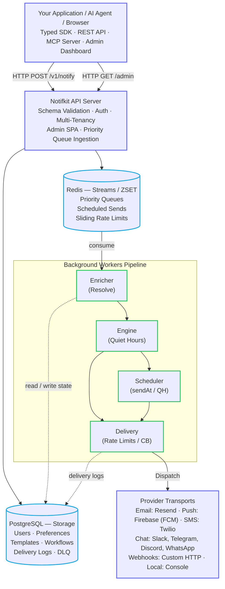

<div align="center">

# notifkit

**You shouldn't have to build a notification system.**

Self-hosted notification infrastructure for product notifications. One API call handles push, email, SMS, chat, and webhooks, with preferences, quiet hours, retries, fallback, scheduling, workflows, an admin dashboard, and delivery logs built in.

[](https://www.npmjs.com/package/notifkit) [](https://www.npmjs.com/package/notifkit) [](https://github.com/devkitshq/notifkit/actions/workflows/ci.yml) [](https://www.typescriptlang.org/) [](https://nodejs.org) [](./LICENSE)

[Documentation](https://notifkit.dev/docs/) · [Quickstart](https://notifkit.dev/docs/quickstart.html) · [Examples](https://notifkit.dev/docs/examples.html) · [notifkit.dev](https://notifkit.dev)

**New:** [We tried to send 500M notifications a month on a $25 server](https://notifkit.dev/articles/notifications-on-a-25-dollar-server.html)

</div>

Like Knock or Courier, except it runs on the PostgreSQL and Redis you already have, your workflows live in your code, and there is no per-message bill. We run it in production, sending about 8M notifications a month (260K a day). Compare: [Novu](https://notifkit.dev/docs/vs/novu.html) · [Knock](https://notifkit.dev/docs/vs/knock.html) · [Courier](https://notifkit.dev/docs/vs/courier.html)

### Sending one notification is easy

```ts
await sendEmail({
  to: user.email,
  subject: "Order Shipped",
  ...
});
```

Sending them reliably is the hard part. Users opt out. People are asleep. Push tokens die. Providers throw 503s. Channels fail and need fallback. Somewhere along the way you need timezone-aware quiet hours, future scheduling, deduplication, multi-channel templates, delivery logs, unsubscribe handling, multi-step workflows, and a dead-letter queue nobody wants to maintain.

notifkit is that machinery. Your app makes one typed call, and notifkit decides who gets the notification, which channel to use, when to send it, whether the user is allowed to receive it, and what to do when delivery fails.

```ts
import { notifkit } from "notifkit";

await notifkit.notify({
  user: "usr_123",
  template: "order-shipped",
  channels: ["push", "email"],
  fallback: true,
});
```

That call tries push, then email if push fails. Preferences, consent, quiet hours, retries, deduplication, throttling, template rendering, and delivery tracking all happen behind it.

## Quickstart

You need Node 22+ and Docker running. In development notifkit starts throwaway PostgreSQL and Redis containers for you. The [full quickstart](https://notifkit.dev/docs/quickstart.html) explains each step.

**1. Install**

```bash
npm install notifkit @notifkit/provider-resend
npm install -D tsx @testcontainers/postgresql @testcontainers/redis
```

**2. Start the server**

```ts
// server.ts
import { NotifkitServer } from "notifkit";
import { ResendTransport } from "@notifkit/provider-resend";

const server = new NotifkitServer({
  services: ["all"],
  port: 3000,
  providers: [
    new ResendTransport({
      apiKey: process.env.RESEND_API_KEY!,
      from: "notifications@yourdomain.com", // a domain verified in Resend
    }),
  ],
});

await server.start();
```

```bash
ADMIN_API_KEY=supersecretkey RESEND_API_KEY=re_xxx npx tsx server.ts
```

**3. Create a project.** In a second terminal:

```bash
ADMIN_API_KEY=supersecretkey npx notifkit-create-project "my-app"
```

It prints `NOTIFKIT_API_KEY=nk_live_…` once. Only a hash is stored, so save it now.

**4. Send**

```ts
// client.ts
import { NotifkitClient } from "notifkit";

const notifkit = new NotifkitClient({
  baseUrl: "http://localhost:3000",
  apiKey: process.env.NOTIFKIT_API_KEY!,
});

await notifkit.syncTemplates({
  templates: [
    {
      id: "order-shipped",
      channel: "email",
      content: { subject: "Order #{{orderId}} shipped", text: "Your order is on the way!" },
    },
  ],
});

await notifkit.addUser("usr_123", [{ channel: "email", target: "alex@acme.com" }]);

await notifkit.notify({
  user: "usr_123",
  template: "order-shipped",
  channels: ["email"],
  data: { orderId: "9481" },
});
```

```bash
NOTIFKIT_API_KEY=nk_live_xxx npx tsx client.ts
```

The SDK is optional. From any other language it is `POST /v1/notify` with the key as a bearer token; see the [REST reference](https://notifkit.dev/docs/reference.html#endpoints).

### Development vs. production

In development, Docker is the only prerequisite: notifkit starts throwaway PostgreSQL and Redis containers for you. Production needs Node 22+, PostgreSQL, Redis, `NODE_ENV=production`, and `npx notifkit-migrate` before start. See [Deployment](https://notifkit.dev/docs/deployment.html#what-you-are-building) and [Migrations](https://notifkit.dev/docs/deployment.html#migrations-and-the-second-replica).

To share a database with an app that already owns `public`, set `DB_SCHEMA`. Read [Installing into a custom PostgreSQL schema](https://notifkit.dev/docs/deployment.html#installing-into-a-custom-postgresql-schema) first: never set it on an install that already runs in `public`.

## Star the project

If notifkit saved you from building notification plumbing, [star it on GitHub](https://github.com/devkitshq/notifkit). Stars are how other developers find the project.

## Running in production

notifkit runs in production at my own company, delivering about 260K notifications a day across email, push, and OTPs. I built it because I needed it and didn't want to spend months rebuilding distributed notification plumbing or pay a SaaS per alert. It runs on your servers, with your provider accounts and your data.

### Reliability and resilience

Every component is tested against failure using real testcontainers:

- **Crash recovery**: Worker processes killed with `SIGKILL` mid-stream lose zero messages. Redis Streams consumer groups (PEL) auto-reclaim and replay in-flight work.
- **Connection resilience**: Disconnections from PostgreSQL or Redis trigger automatic backpressure and reconnects without dropping state.
- **High throughput & concurrency**: 10,000+ notification bursts with sliding-window rate limiters, flat memory profiles, and 24-hour idempotency deduplication.

## Scope

notifkit is the durable notification layer that runs inside your own stack. It is not a marketing automation suite, and it does not replace Customer.io, OneSignal, or SendGrid. You bring your own provider accounts and pay them directly.

First-party providers cover Resend, Firebase Cloud Messaging, Slack, Twilio, Telegram, Discord, and WhatsApp. Anything else is a `Transport` class with a `send()` method.

## Run it from your AI agent

https://github.com/user-attachments/assets/4dff98bb-37d3-44b4-bf46-9607c1cd89b5

Connect the notifkit MCP server to Claude Code, Cursor, or any MCP client:

```bash
claude mcp add notifkit \
  --env NOTIFKIT_URL=http://localhost:3000 \
  --env NOTIFKIT_API_KEY=nk_live_... \
  -- npx -y @notifkit/mcp
```

Then ask:

```text
You:   Why didn't usr_9182 get their password reset?

Agent: It was never sent. Their address hard-bounced yesterday and is
       suppressed, so notifkit skipped it. Want me to remove the
       suppression and resend once they've fixed it?
```

```text
You:   How did yesterday's spring-sale campaign do?

Agent: 194 delivered, 4 bounced, 2 suppressed. 71 opened (37%),
       12 clicked (6%).
```

[See more in the MCP docs](https://notifkit.dev/docs/mcp.html)

## AI-assisted migration

Already have notification code scattered across your application? Point your coding agent at:

```text
https://notifkit.dev/llms-full.txt
```

It can read notifkit's API from there, find ad-hoc notification code in your repository, and refactor it into notifkit calls.

## Built in

| Feature             | What you get                                                                                                                                 |
| :------------------ | :------------------------------------------------------------------------------------------------------------------------------------------- |
| **Fallback**        | A failed channel hands off to the next one in the order you give: push, then SMS, then email.                                                |
| **Priority lanes**  | `critical` sends run on their own stream and skip quiet hours, so an OTP never waits behind a marketing blast.                               |
| **No double sends** | Repeat a request with the same `X-Idempotency-Key` within 24 hours and it is delivered once.                                                 |
| **Consent**         | One-click unsubscribe from the mail client (RFC 8058). Unsubscribes, complaints, and hard bounces suppress the address, even for `critical`. |
| **Multi-tenancy**   | One deployment serves many apps. Each project gets its own API keys, data, and rate limit.                                                   |

## Providers

Bring your own provider accounts. First-party packages:

- [`@notifkit/provider-resend`](./packages/provider-resend): transactional email via Resend
- [`@notifkit/provider-fcm`](./packages/provider-fcm): push notifications via Firebase Cloud Messaging
- [`@notifkit/provider-slack`](./packages/provider-slack): Slack messages via Incoming Webhooks or the Web API
- [`@notifkit/provider-twilio`](./packages/provider-twilio): SMS via Twilio, with signature-verified delivery status callbacks
- [`@notifkit/provider-telegram`](./packages/provider-telegram): messages via a Telegram bot
- [`@notifkit/provider-discord`](./packages/provider-discord): messages via a Discord webhook
- [`@notifkit/provider-whatsapp`](./packages/provider-whatsapp): messages via Meta's WhatsApp Cloud API
- [`@notifkit/provider-console`](./packages/provider-console): console transport for local development and testing

For anything else, implement a `Transport`:

```ts
class MyTransport implements Transport {
  async send(message) {
    // Send through SES, Postmark, APNs,
    // SendGrid, a custom webhook, or anything else.
  }
}
```

The keys, the billing, and the deliverability stay yours.

## Admin dashboard

Templates, workflows, and routing live in your code. The dashboard at `/admin` is an optional ops console for looking at what happened and cleaning up after it:

- **Look:** a live activity feed, delivery logs, queue depth per priority lane, workflow runs step by step, and each user's contacts and preferences.
- **Fix:** replay or discard dead letters, cancel scheduled sends, and create or revoke projects and API keys.

To sign in, set `ADMIN_EMAIL` and `ADMIN_PASSWORD` before starting the server, then open `http://localhost:3000/admin`. `npx notifkit-create-admin` reads the same variables (plus `DATABASE_URL` and `DB_SCHEMA`) to add a login later.

The dashboard is served from the prebuilt bundle in `dashboard/dist`. To work on it, run `npm --prefix dashboard run dev`; the API server proxies `/admin` to Vite on port 5173.

## How it runs

notifkit is an orchestration engine and a typed SDK.


```mermaid
flowchart TD
    App["Your Application / AI Agent / Browser<br/>Typed SDK · REST API · MCP Server · Admin Dashboard"]

    App -->|"HTTP POST /v1/notify"| API
    App -->|"HTTP GET /admin"| API

    API["Notifkit API Server<br/>Schema Validation · Auth · Multi-Tenancy<br/>Admin SPA · Priority Queue Ingestion"]

    API --> PG
    API --> REDIS

    PG[("PostgreSQL — Storage<br/>Users · Preferences<br/>Templates · Workflows<br/>Delivery Logs · DLQ")]
    REDIS[("Redis — Streams / ZSET<br/>Priority Queues<br/>Scheduled Sends<br/>Sliding Rate Limits")]

    subgraph WORKERS["Background Workers Pipeline"]
        direction LR
        ENRICH["Enricher<br/>(Resolve)"] --> ENGINE["Engine<br/>(Quiet Hours)"] --> DELIVER["Delivery<br/>(Rate Limits / CB)"]
        ENGINE --> SCHED["Scheduler<br/>(sendAt / QH)"]
        SCHED --> DELIVER
    end
    REDIS -->|"consume"| ENRICH
    ENRICH -.->|"read / write state"| PG
    DELIVER -.->|"delivery logs"| PG
    DELIVER -->|"Dispatch"| PROVIDERS

    PROVIDERS["Provider Transports<br/>Email: Resend · Push: Firebase (FCM) · SMS: Twilio<br/>Chat: Slack, Telegram, Discord, WhatsApp<br/>Webhooks: Custom HTTP · Local: Console"]

    classDef entry stroke:#6366f1,stroke-width:2px
    classDef store stroke:#0ea5e9,stroke-width:2px
    classDef work stroke:#22c55e,stroke-width:2px
    class App,API,PROVIDERS entry
    class PG,REDIS store
    class ENRICH,ENGINE,DELIVER,SCHED work
```

`NotifkitServer` runs the HTTP REST API router (`/v1/notify`, `/health`, `/metrics`), the built-in admin dashboard (`/admin`), and the background worker pipelines: enricher, decision engine, scheduler, and delivery. `NotifkitClient` is the lightweight client your application uses to trigger notifications, sync templates, and manage users over HTTP.

### Topologies

In a single process, the API and all workers run in the same Node.js process (`services: ["all"]`), which works for small and medium apps, side projects, and staging. Distributed, you run stateless API servers (`services: ["api"]`) behind a load balancer and scale worker pools (`services: ["enricher", "engine", "delivery", "scheduler"]`) horizontally across Redis Streams consumer groups.

## Documentation

Everything lives at [**notifkit.dev/docs**](https://notifkit.dev/docs/).

| Guide                                                                          | Description                                              |
| :----------------------------------------------------------------------------- | :------------------------------------------------------- |
| [Quickstart](https://notifkit.dev/docs/quickstart.html)                        | Install to first delivered notification                  |
| [How it works](https://notifkit.dev/docs/concepts.html)                        | Core concepts and the notification pipeline              |
| [Channels & fallback](https://notifkit.dev/docs/guides/routing.html)           | Multicast, ordered fallback, and custom transports       |
| [Preferences & quiet hours](https://notifkit.dev/docs/guides/preferences.html) | Preference, consent, and timing rules                    |
| [Templates & AI](https://notifkit.dev/docs/guides/templates.html)              | Interpolation, escaping, and per-channel content         |
| [Segments & scheduling](https://notifkit.dev/docs/guides/segments.html)        | Fan-out, priority lanes, `sendAt`, and idempotency       |
| [Workflows](https://notifkit.dev/docs/guides/workflows.html)                   | Multi-step sequences, recurring sends, and digests       |
| [Examples](https://notifkit.dev/docs/examples.html)                            | Runnable projects                                        |
| [Architecture](https://notifkit.dev/docs/architecture.html)                    | Streams, delivery guarantees, topologies, and data model |
| [Deployment](https://notifkit.dev/docs/deployment.html)                        | Docker, Compose, and production topologies               |
| [Operations](https://notifkit.dev/docs/operations.html)                        | Health, metrics, DLQ, key rotation, and shutdown         |
| [Reference](https://notifkit.dev/docs/reference.html)                          | API, payloads, and SDK methods                           |
| [MCP server](https://notifkit.dev/docs/mcp.html)                               | Operate notifkit from an AI agent                        |

## Why build this?

Notification infrastructure looks simple until you're responsible for it. Queues, retries, provider adapters, preference systems, quiet-hour logic, workflows, suppression handling, and operational tooling take months to build well. notifkit is what I built instead, and it's what I run.

## Contributing

Issues and pull requests are welcome.

```bash
npm install
npm run build
npm run build:dashboard
npm test
```

The test suite starts its own PostgreSQL and Redis containers, so Docker is the only thing you need running.

## Contact

Questions, bugs, or ideas: [contact.devkitshq@gmail.com](mailto:contact.devkitshq@gmail.com), or open an issue.

## License

MIT. Do what you like with it, including commercially. See [LICENSE](./LICENSE).

notifkit is free. Every feature is in this repository: there is no paid edition and no hosted tier.
